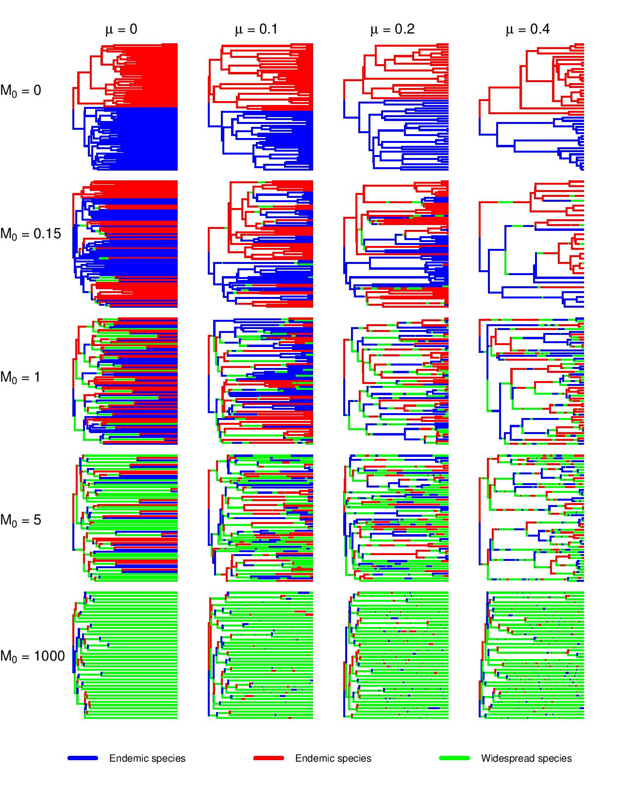
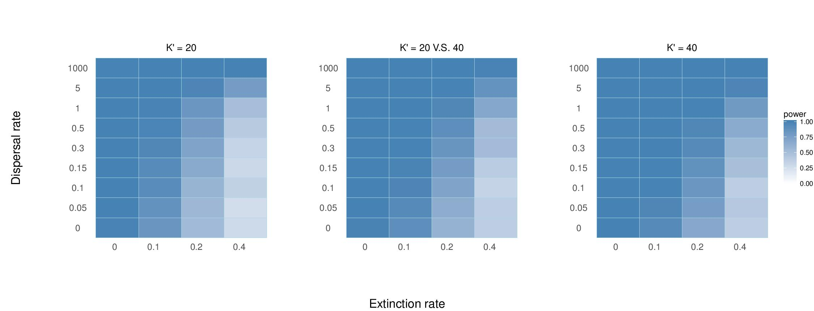
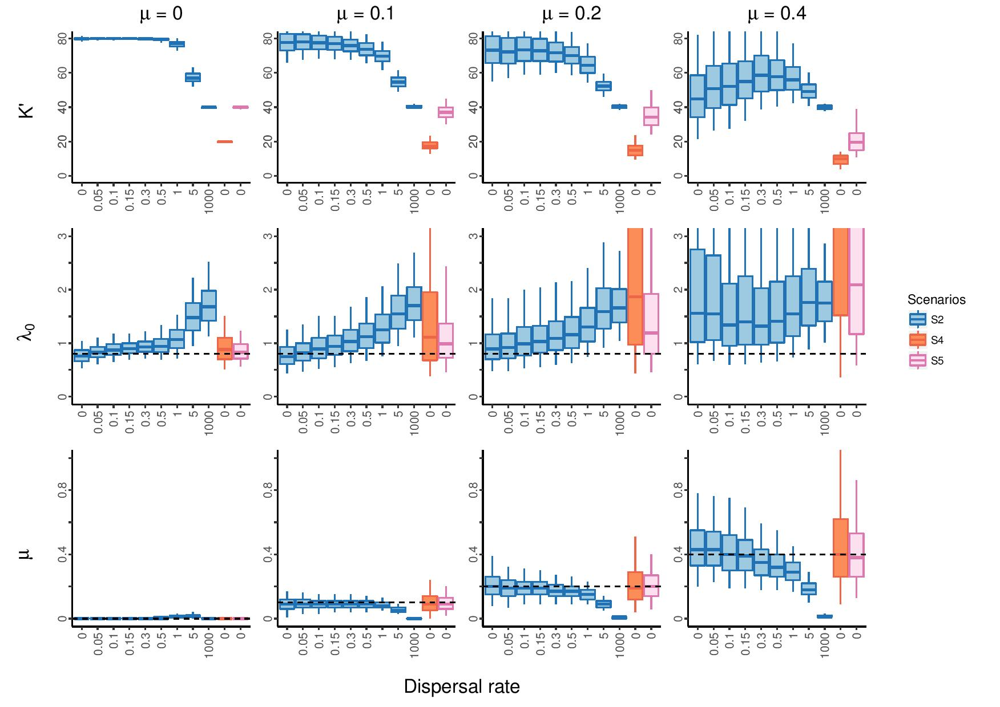

Welcome to [Liang&apos;s blog](https://xl0418.github.io/)! This is my first PhD project since 2015 joining [Etienne&apos;s lab](https://www.rug.nl/staff/r.s.etienne/). You will find a brief introduction to this project. The code for the model can be found on my [GitHub](https://github.com/xl0418/code).

This my first formal research project starting from December of 2015 to February 2018 when the paper gets published. It seems to take quite a long time. Because I spent some time to switch from mathematics to evolutionary science and writing paper costs time as well. Anyway, to commemorate the first paper. 

<!--more-->
## Abstract
Whether there are ecological limits to species diversification is a hotly debated topic. Molecular phylogenies show slowdowns in lineage accumulation, suggesting that speciation rates decline with increasing diversity. A maximum likelihood method to detect diversity-dependent diversification from phylogenetic branching times exists, but it assumes that diversity-dependence is a global phenomenon and therefore ignores that the underlying species interactions are mostly local, and not all species in the phylogeny co-occur locally. Here, we explore whether this maximum likelihood method based on the non-spatial diversity-dependence model can detect local diversity-dependence, by applying it to phylogenies, simulated with a spatial stochastic model of local-diversity-dependent speciation, extinction and dispersal between two local communities. We find that type I errors (falsely detecting diversity-dependence) are low, and the power to detect diversity-dependence is high when dispersal rates are not too low. Interestingly, when dispersal is high the power to detect diversity-dependence is even higher than in the non-spatial model. Moreover, estimates of intrinsic speciation rate, extinction rate and ecological limit strongly depend on dispersal rate. We conclude that the non-spatial diversity-dependent approach can be used to detect diversity-dependence in clades of species that live in not too disconnected areas, but parameter estimates must be interpreted cautiously.

## Model
We have developed a spatial diversity-dependent diversification model to explore if the global version of the diversity-dependence approach could detect the diversity-dependent signal on the spatial scenario. 

## Generating trees
The idea is simple. For simplicity, we build a two-location model and let species evolve (speciate: give birth to a new species/ extinction: one species goes extinct) in the regime. A pack of generated trees under different speciation rates and extinction rates and dispersal rates is like this (Scenario 2, see details in our paper):

## Applying the bootstrapping analysis
We exploit the bootstrapping analysis to examine the power of the global approah to detect the signal of diversity-dependence on the spatial structered trees. The following tables show the power of the global tool for signal detection under different parameter combinations and scenarios.

## Parameter inference
As due to the complexity of the model, an analytical likelihood function is not possible to achieve. Therefore, we test if the global likelihood approach can recover the parameters on the spatial model or show some patterns.

## Conclusion
From the results above, the conclusion is clear. Please see our paper:-)

## Reference
Xu, L., & Etienne, R. S. (2018). Detecting local diversity-dependence in diversification. Evolution, 72(6), 1294-1305. DOI: 10.1111/evo.13482 
  
Etienne, R. S., Pigot, A. L., & Phillimore, A. B. (2016). How reliably can we infer diversity-dependent diversification from phylogenies? Methods in ecology and evolution, 7(9), 1092-1099. DOI: 10.1111/2041-210X.12565

Etienne, R. S., Haegeman, B., Stadler, T., Aze, T., Pearson, P. N., Purvis, A., & Phillimore, A. B. (2012). Diversity-dependence brings molecular phylogenies closer to agreement with the fossil record. Proceedings of the Royal Society of London. Series B, Biological Sciences, 279(1732), 1300-1309. DOI: 10.1098/rspb.2011.1439
