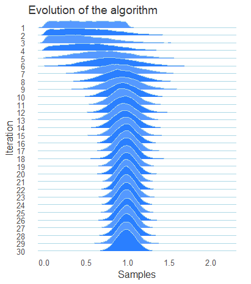
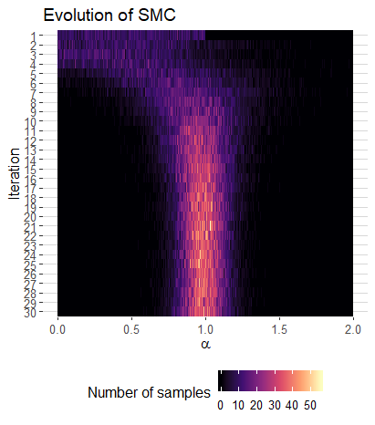

Finally, I have done visualizing the evolution of SMC in R instead of in Python. Here, two illustrations are given. 

<!--more-->

## Generating Data
The data I used in the examples is generated under SMC applying on our trait-population coevolution model, a likelihood-free method for searching the true parameters when an analytic formulation of the model is not achievable. The data is consisting of 30 iterations samples. Each iteration contains 10K sampling. The algorithm starts by sampling from a uniform distribution in range (0,1). After each iteration, it computes the fitness of the samples and highly weights the samples with high fitness. Finally, it converges to the true value.  

## Mountain plot
Mountain plot is recently highly evaluated theme for comparing the distribution of data across groups. The idea is stem from [Henrik's plot](https://twitter.com/hnrklndbrg/status/883675698300420098)

Forget to point out the true value is at 1.0, which is the peak of the distribution at 30th iteration. 

## Heatmap plot
Another nice presentation is realized by the heat map. The data was manipulated a bit. The density of the samples was converted to the frequency in tiny cells. Then it can be applied by the heat map plot.

Which one do you prefer?
