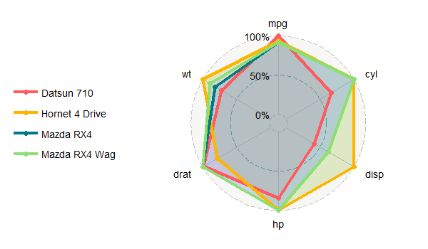
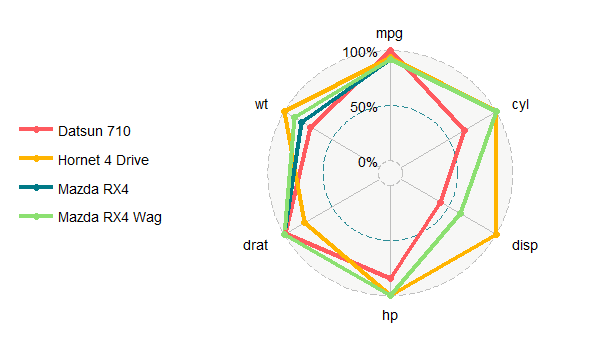
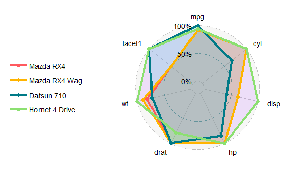
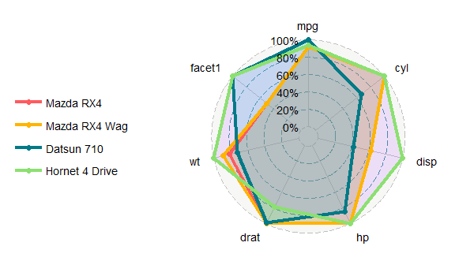
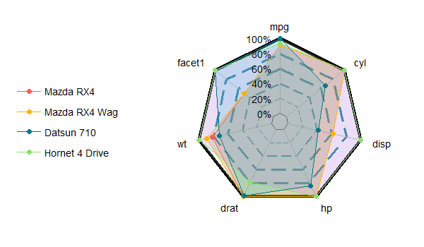
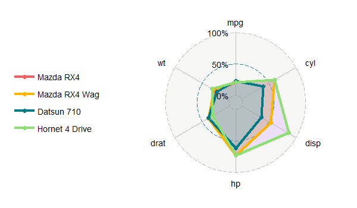
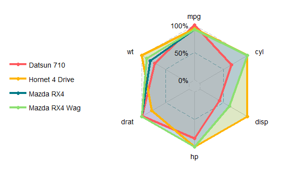
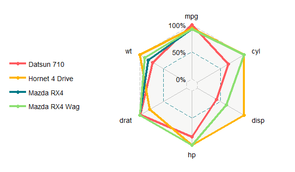
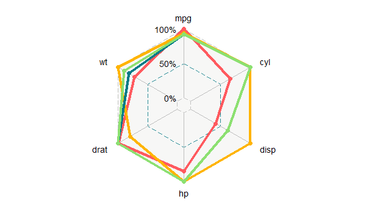

[`ggradar2`](https://github.com/xl0418/ggradar2) is  now available. A large amount of features have been added to make your radar chart powerful. See [`ggradar2`](https://github.com/xl0418/ggradar2) on my [Github](https://github.com/xl0418)

<!--more-->

## Introduction
ggradar2 is a gg-function to draw a radar plot for data analysis. It is stem from [ggradar](https://github.com/ricardo-bion/ggradar) but has been extended with more cool features. 


## Install ggradar2
Run the code 

```R
devtools::install_github("xl0418/ggradar2",dependencies=TRUE)
```

## Use ggradar2
### Load data.

```R
library(ggradar2)
data(mtcars)
% Extract the group names. Otherwise, the first column will be chosen as the group names.
group = row.names(mtcars)
df = cbind(group,mtcars)
% The radar chart is not a nice presentation if you want to compare too many groups. Thus here 
% we only focus on 4 groups.
dftest = head(df,4)
% To better distinguish two different styles, 6 groups are selected for illustration.
dftest = dftest[,1:7]
```

### Default style
By default

```R
ggradar2(dftest)
```

returns 



### No fill with round grid
If you don't want to fill the polygon, run

```R
ggradar2(dftest,polygonfill = FALSE)
```



### Web type
A new web type 'lux' has been added by `webtype`.

mini type

```R
ggradar2(dftest,webtype = 'mini')
```



luxurious type

```R
ggradar2(dftest,webtype = 'lux')
```




### Gird line trend
Use `grid.line.trend = 'increase'` to plot an outward-increasing grid lines.

```R
ggradar2(dftest,style = 'sharp',webtype = 'lux',
              group.line.width = 0.5,grid.line.trend = 'increase',gridline.min.linetype = 'solid',
              gridline.max.linetype = 'solid',gridline.min.colour = 'black',gridline.max.colour='black')
```




### Full score
Use `fullscore = c(...)` to set the full score to each variable.

```R
fullscore <- c(100,10,300,150,10,10)
a <- ggradar2(dftest,fullscore = fullscore)
```




### Sharp grid
A new style has been added. Call out the straight line style by running 

```R
ggradar2(dftest,style = 'sharp')
```



### Sharp grid without fill
Get rid of the fill

```R
ggradar2(dftest,style = 'sharp',polygonfill = FALSE)
```



### Removing the legend 

```R
ggradar2(dftest,style = 'sharp',
polygonfill = FALSE,plot.legend = FALSE)
```



### Multiple plots by subgroups

```R
# Extract 3 brands of cars out of the data frame
facettest <- df[c(1,2,4,5,8:14),]
# Set the subgroup names
facet1 <- mapply(rep,c('Mazda','Hornet','Merc'),c(2,2,7))
facet1 <- Reduce(c,facet1)
facettest <- cbind(facettest,facet1)
ggradar2(facettest,multiplots = TRUE)
```

Notice that the column name for the subgroups should be 'facet1'. Otherwise, ggradar2 could not recognize it.

