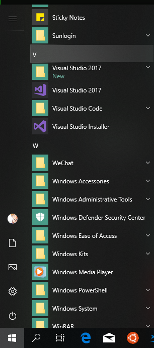
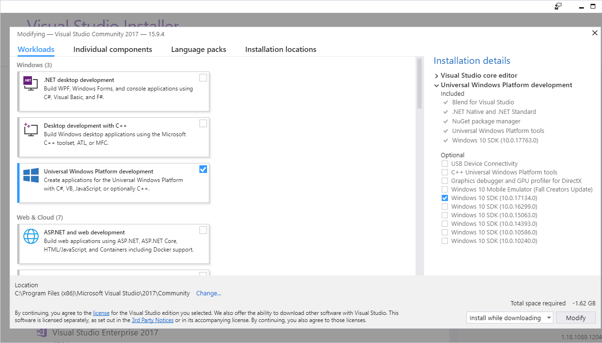

As my research always involves a huge amount of computation, parallel technique is a super fancy way to save my time. But the resource of cluster at my university is limited. I recently received a warning that CIT has detected multiple-account usage under my IP. To avoid the risk of being fired, I have to figure out another way to parallelize my job instead of parallelizing accounts. Right on time, GPU programming came out as an ideal option. I hope the GPU resource of my university is not full loaded yet.

Due to some incompatibilities of CUDA and Visual Studio 2017, I spent half a day to figure out the solutions and finally succeeded building up GPU programming environment on Windows 10 with Pycuda installed in Python. Here, I post the procedure of the build and some solutions to the incompatibilities.

<!--more-->
 
# Prerequisite 

For now, I am working on **Windows 10** with **Python 3.7.0**. The CUDA version that is compatibly built up for me is **CUDA 10.0**. I used **Pycharm 2018.3** as the Python IDE. Probably I will try to build on OS 10 soon in the future.

# Simple procedure 

1.  Install [Python 3.7](https://www.python.org/downloads/) and [PyCharm 2018.3](https://www.jetbrains.com/pycharm/download/).

2.  Install [Visual Studio 2017](https://visualstudio.microsoft.com/zh-hans/downloads/) as CUDA needs C++ compile. 

3.  Open the Visual Studio installer under the folder Visual Studio 2017. 
 

4. Select: **Modify** under Visual Studio 2017 -> **Installation details**.

5. Install options: select only the **Windows 10 SDK**.

6.  Install [CUDA 10.0](https://developer.nvidia.com/cuda-downloads?target_os=Windows&target_arch=x86_64&target_version=10&target_type=exelocal) and follow the steps [here](https://docs.nvidia.com/cuda/cuda-quick-start-guide/index.html#windows) to set up CUDA environment.

# Tips

- To make sure that CUDA is successfully installed, check `nvcc -v` at your terminal. 
- The step to build samples in Nvidia's guide is not necessary. I couldn't build the samples due to some incompatibilities of vs c++ but still have it work on Python.

# Problem shooting

- **CUDA install failed**

I only came across this issue on my desktop at office that has an old monitor. Then, I resolved it by customizing the installation with uncheck of Visual Studio integration. No idea why but it works. Also check answer [here](https://www.reddit.com/r/nvidia/comments/9d2f23/cuda_install_problems_windows_10_geforce_1070ti/)

- **nvcc fatal : Cannot find compiler 'cl.exe' in PATH **

Check [here](https://stackoverflow.com/questions/8125826/error-compiling-cuda-from-command-prompt). In principle, you should add `cl.exe` to the environment variables.
