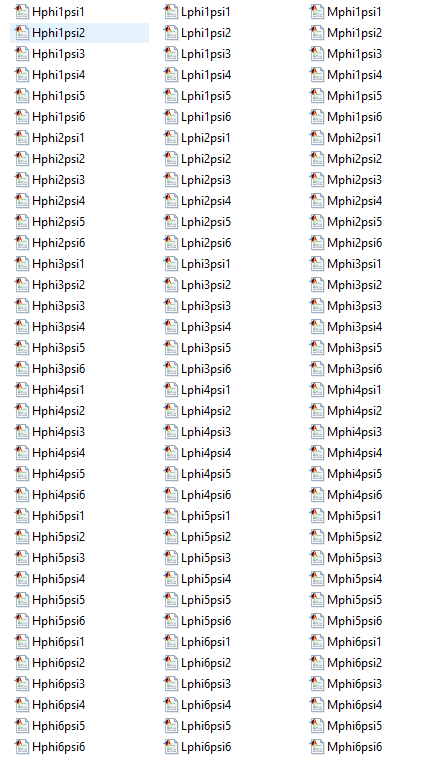
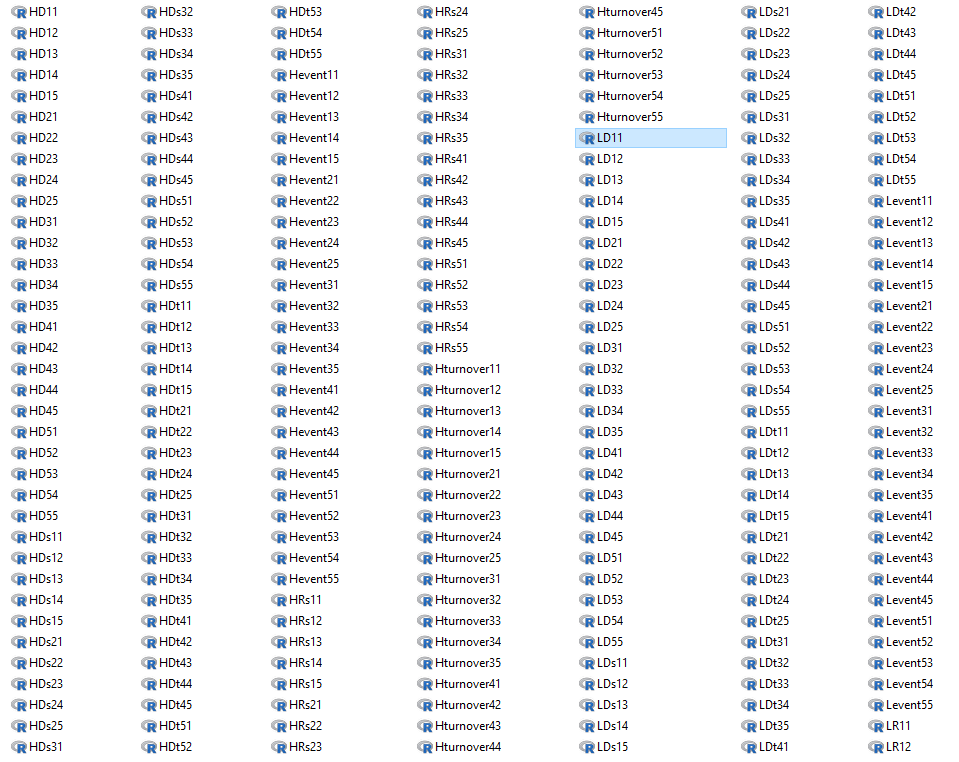

As my 2nd project is close to an end, it is right the time to go back to the phylogenetic Janzen-Connell model. Simulations and plotting functions have been done during the gap time squeezed from the 2nd project. The last thing is to analyze the data, in which I bumped into a weird behavior of `sed`. 

<!--more-->

## The data file
In this project, I have generated in total 108 data file in `.m` (Matlab) format. Each file contain several distance matrix, abundance vectors, an event table and turnover ticks that I want to extract and analyze exclusively. 



## Extract the matrix
The procedure is simple. I modified the previous experimental bash scripts a bit to fit the file names of data. Then execute them sequentially on Windows prompt.

1. Run `extractallDs.sh` and `extractallRs.sh` to extract all D matrix and R matrix from the raw files into `LRsij.Rdata,MRsij.Rdata,HRsij.Rdata,LDsij.Rdata,MDsij.Rdata,HDsij.Rdata`.
2. Run `Dlast.sh` to extract the last D and R matrix into `LDij.Rdata,LRij.Rdata,MDij.Rdata,MRij.Rdata,HDij.Rdata,HRij.Rdata`.
3. Do the same thing to extract event table and turnover ticks by running `loopextractEve_Turn.sh`

like 



But I obtained nothing in the files. 

## Bug shooting
Same simulation code generates the same data structure. But why couldn't the same bash script extract information as before? At that moment, I kind of had a feeling that it must be that the script cannot recognize the newline sign. like the following, if the computer cannot match `\r`, which is the code for the newline under windows and DOS, the script extracts nothing. 
 
```bash
#!/bin/bash
for j in {0..4};
do
for i in {0..4};
do 
sed -n '/D'{'length(D)+1'}' = \[\r/,/\];/p' test"$j$i".m > Ds"$j$i".Rdata
echo $j$i' done'
done
done
```

But after I changed it to `\n` that is the right code for a linux file, it didn't work neither. Even after changing the file code via `unix2dos`, none of the means worked.

\\(\boldsymbol{Finally}\\), after several hours of googling, thinking, patting the computer, I tried out the solution. The scripts need to be executed under the linux system. I launched them on Ubuntu again, the newline sign was recognized. 

But it is still a mystery to me that why on a windows prompt none of `\r` and `\n` can be recognized. If you know it, pls reply this post. Thanks!