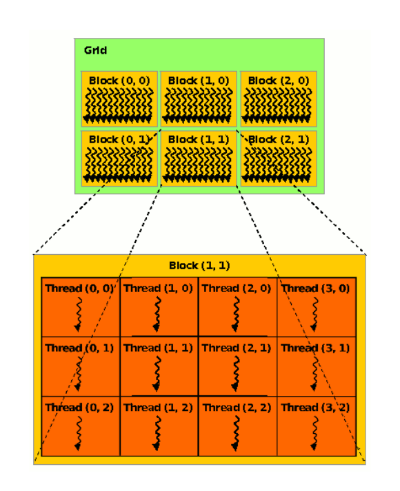
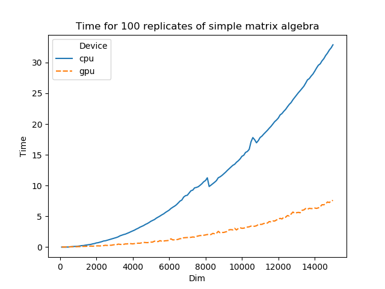

In this post, you will find a simple matrix algebra done by gpu parallelization and a straightforward result of the speed contest between cpu and gpu.

<!--more-->
 
# A simple matrix algebra to be parallelized

As a first try, I intended to parallleize a simple matrix algebra in my Project 2 that can be computed as follows on Python:

```Python
c = a_cpu[:,np.newaxis]-a_cpu
```

This is a formula to compute the discrepancy of any pair of elements given by a vector. For example, input 

```Python
a = np.array([1,2,3])
```

the formula should return 

```Python
c = array([[0,-1,-2,],
	[1,0,-1],
	[2,1,0]])
```

A standard python code like the formula above by using `numpy` package, every element in `c_cpu` is computed in a serial order. 

In terms of the power of current cpu, for a lower dimensional matrix, you can hardly feel the elapsed time to compute out the equation. However, if you have a huge matrix of 10000X10000 size and want to loop it 100 times, it costs half a minute on an i7 4790k cpu, although you may ignore the little time consumed. But it is not rare to have a large matrix bigger than 1 million by 1 million and loop it billion times at least in an evolutionary problem. In this case, you are saving your life if the compulation time can be reduced.

# A shortcut to understand GPU parallel computation

Now we have a good way to save our life instead of having a weird pill. CUDA is a parallel computing platform and application programming interface (API) model created by [Nvidia](https://developer.nvidia.com/nvidia-developer-zone). [PyCUDA](https://documen.tician.de/pycuda/index.html) provides a python package to allow people to parallelize their computation on a Graphic Processing Unit (GPU) by Python. For sure, I didn't say everything is parallelizable. Only the procedures that are consisting of independent calculation paths can be parallelized, which means you work on different paths at the same time instead of doing them one by one. Hence, the amount of time that can be saved relies on the percentage of work that is parallelizable in your work. In this sense, matrix algebra is a good representative. Other applications of parallelism involves rendering graphics to a screen, running a Monte Carlo Simulation, multiplying matrices for a machine learning algorithm, or powering a database. Google them yourself. 


Why does GPU possess such powerful ability? It owes to its design purpose. A graphic card is designed to process graphics and render them to a screen. What is a graphic? It is just like a matrix. So to process a matrix, the ability to compute multiple entries of the matrix is more important than the ability to deal with just one entry smartly. Hence, a gpu is designed to own a huge amount of threads that can process multiple calculations at one time although they are slow while a cpu only contains few (like an i7 4790k has 4 physical cores which means 4  physical threads, at most 8 threads if including hyperthreads tech) but are faster. A good analogy is that a gpu is like a cluster of students at primary school while a cpu is like a professor. When calculating a complex problem, the professor is definitely faster and smarter. But when computing lots of simple algebra, the cluster of primary students is faster. In summary, CPUs are designed for running a small number of potentially quite complex tasks. GPUs are designed for running a large number of quite
simple tasks.

# Parallelize the matrix algebra

After having a rough idea of parallelism, let's do it on practice. For a matrix algebra like the above example, what are the independent calculation paths? Apparently, each entry of the output matrix `c` is computed out independently given the input `a`. Thus, we could assign each calculation path to a thread on GPU. 

```Python

kernel_code_template = """
__global__ void com_t(int matrixsize,float *a, float *c)
{

    // 2D Thread ID 
    int tx = blockDim.x*blockIdx.x + threadIdx.x; // Compute column index
    int ty = blockDim.y*blockIdx.y + threadIdx.y; // Compute row index

    // Pvalue is used to store the element of the matrix
    // that is computed by the thread
    float Pvalue = 0;

    // Each thread loads one row of M and one column of N, 
    //   to produce one element of P.
    if((ty <matrixsize) && (tx < matrixsize))
    {
    float Aelement = a[ty];
    float Belement = a[tx];
    Pvalue = Aelement - Belement;
    // Write the matrix to device memory;
    // each thread writes one element
    c[ty * matrixsize + tx] = Pvalue;
    }
}
"""
```


The most important part of parallelism on GPU is the kernel function which is coded for a single calculation path. The only difference among different calculation paths is the locality information of the entries of matrix `c` in the memory. Normally, we can envisage a memory on GPU as a cluster of grids of blocks of threads. But in fact, it is not this physical structure on the borad of the card. It involves streaming processors (SMs) dealing with wraps. However, here we better use the metaphor.



Each entry in matrix `c` corresponds to a specific combination of `gridIdx.x,gridIdx.y,blockIdx.x,blockIdx.y,threadIdx.x,threadIdx.y`. The value of the indexes also depend on how we allocate the size of grid, block. A regular way for a matrix algebra is to fit the struture to the matrix. For example, if we want to compute a 5X5 matrix, we can allocate the size of block as 5X5 which means we will use a matrix of 5X5 threads for compuatation. But a block contains at most 1024 threads for the current card (GTX 970). Thus for a square matrix we can allocate at most a size of 32X32 threads for one block. If we want to work on a larger matrix, we need more blocks or even more grids. This then causes one issue that some threads may not be used if the matrix size is not a multiplier of the block size. Therefore, we need to constrain our computation within the matrix by using `if((ty <matrixsize) && (tx < matrixsize))`. And make sure the evaluation of matrix `c` is put in the loop. Otherwise, the over requested threads (if the requested threads don't fit the matrix size) will be invoked and replace the inner results in `c`.

Once we have correctly allocated the memory and located the entry by these indexes, we can formulate your calculation. After that, the code will be uploaded to GPU and tranferred to the code of GPU (compile). Once all entries have been calculated, the results will be stored in the memory on GPU. Then cpu will pull back the result.  

```Python

# compile the kernel code
mod = compiler.SourceModule(kernel_code_template)

# get the kernel function from the compiled module
matrixmul = mod.get_function("com_t")

matrixsize = 3
BLOCK_SIZE = 2

# call the kernel on the card
matrixmul(np.uint32(matrixsize),
    # inputs
    a_gpu,
    # output
    c_gpu,
    # 4 blocks of BLOCK_SIZE x BLOCK_SIZE threads
    grid = (2,2,1),
    block = (BLOCK_SIZE, BLOCK_SIZE, 1),
    )
```

# Speed comparison between CPU and GPU

At last, to show the power of GPU even on such simple matrix algebra, I run calculation for different dimensions and loop each calculation 100 times to enlarge the time consumption.



As the figure shows, the time consumption for 100 times calculations starts to significantly split up when the dimension of matrix is over 2000. The time consumption on CPU grows almost exponentially along the dimension while on gpu it only grows a little. With the increase of dimension, you save a huge amount of your time and your life.

# End
This is a quite simplified introduction to a parallelism example. There is a bank of posts explaining parallelism better and more exhaustive than this one. However, my goal here is to use a simple example and a short length of words to have you get an idea of how it works instead of scaring you away from this field. Once you fall into the trap of "it looks as simple as the author said", I believe you will learn more by yourself :-)

# Reference
[CUDA Programming] by Shane Cook is a good start book for learning both the hardware and the language. 

This [PyCUDA website](https://andreask.cs.illinois.edu/PyCuda) provides some examples on Python.

# Full code
It contains the example code and the speed test. Clone it [here](https://github.com/xl0418/GPU_Python/blob/master/gpu_cpu_speedtest.py)
