There are tons of documents out there to explain how neural network works in different angles. So I guess people don't mind me adding one more from my perspective. Hopefully, someone may get inspired from this post.

<!--more-->

In short, the neural network is a kind of system that transforms the input data into its corresponding output (or labels), strictly speaking, for a supervised learning. This system is consisting of three types of layers, i.e. the input layer, the hidden layer and the output layer. Normally, the hidden layer may have multiple layers according to one's design. Among layers, the data from the upper layer are transformed to the data in the lower layer via a linear combination with an initialized weight matrix. After that, a nonlinear transformation that is generally called the activation function is applied to the data that would be converted to a form for the next round until reaching the output layer. To assure the neural network feedback the correct output, people need to train the neural network by adjusting the weight matrix. They are usually adjusted via minimizing the error between the output from the final layer and the known output from the data used for training. 

Without loss of generality, here I consider a simplest neural network which only possesses fully connected layers, meaning that every neuron in each layer connects all neurons of the upper and lower layers. The mathematical logic behind is analogous to other structures of neural network. Firstly, I used a series of graphs to illustrate how the data flows to the final layer and introduce the notations used in the derivation. Then, a general formulation is present subsequently.

# A 6-layer neural network 

The following four graphs illustrate how the data evolves along the neural network and the notations used in the derivation.

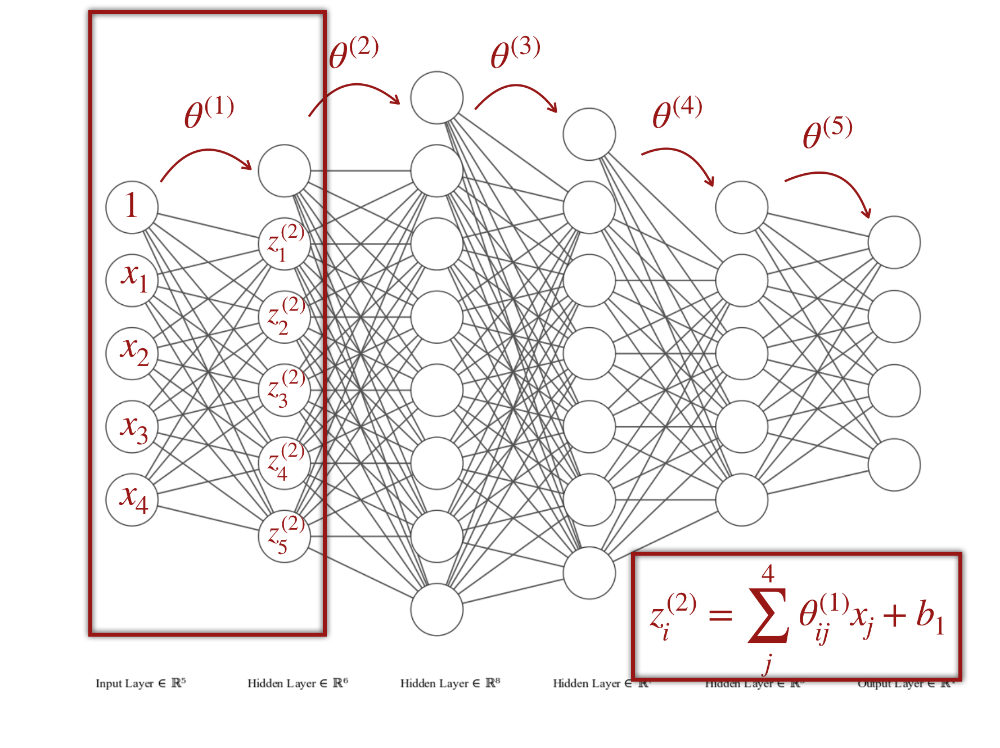    

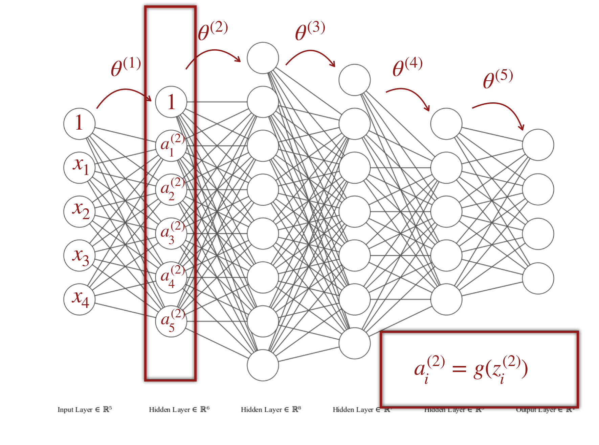    

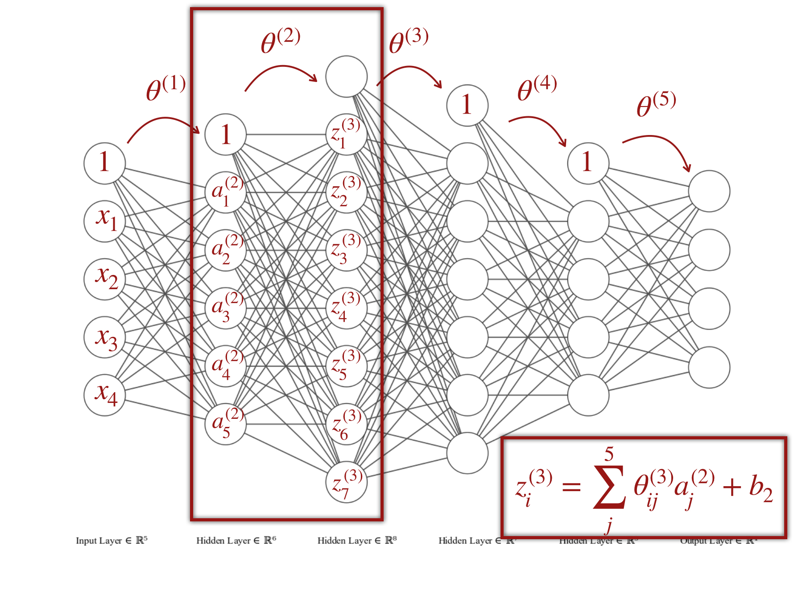    

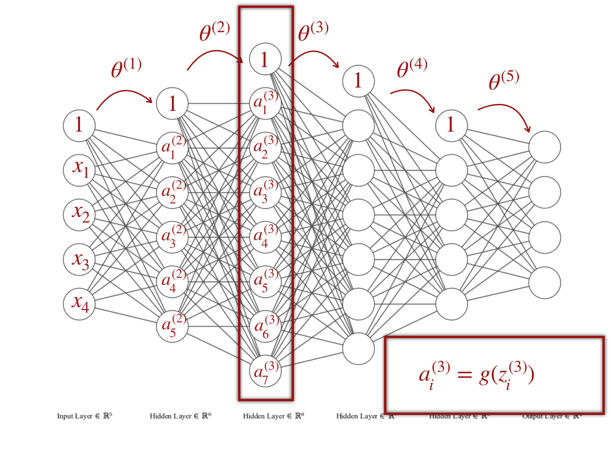   

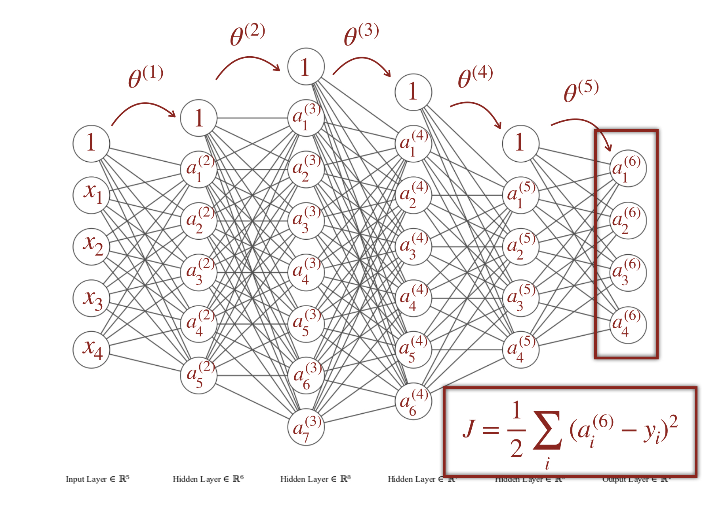 

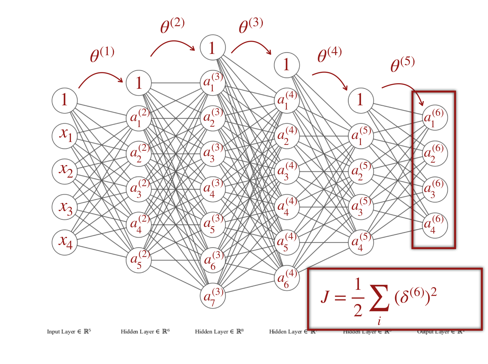         

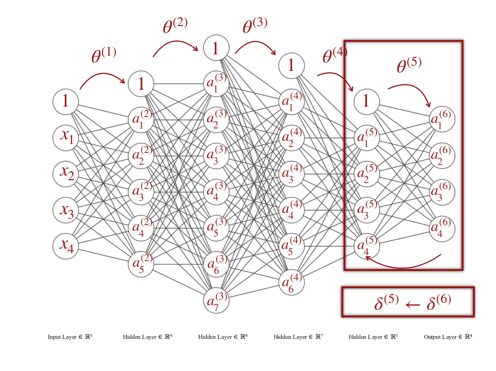     

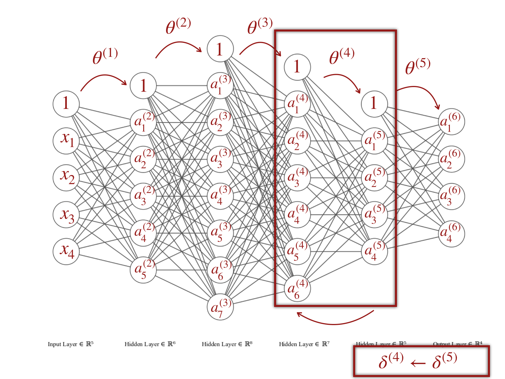     


# 1 Forward flow of the neural network

Consider a neural network with \\(k+1\\) layers including the input layer and the output layer. The input data is consisting of \\(n\\) samples with \\(L_{1}\\) features

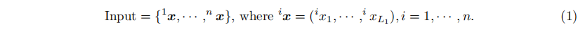   

The output label is given accordingly

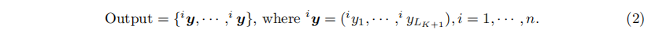   

where the label on the top left denotes the index of the sample. Too abstract? Imagine that sample \\(^{1}\boldsymbol{x}\\) corresponds to model 1 while sample \\(^{2}\boldsymbol{x}\\) corresponds to model 2. Then the output can be either an array of two vectors indicating the probabilities of model 1 and model 2, for example, \\(\{(1,0),(0,1)\}\\), or a vector of two elements \\(\{0,1\}\\) where 0 indicates model 1 and 1 indicates model 2 or whatever you label them. The purpose is to use a huge amount of data sets to train the neural network, more precisely to compute the weight matrix among the adjacent pair of layers, to fit the output layer to the output vectors. Will see it later on.

Now, let's feed one sample (the first one \\(^{1}\boldsymbol{x}\\)) to the neural network to see how to compute the output layer. Later, we will see how to train the network with multiple samples. Assume the second layer has \\(L_{2}\\) neurons

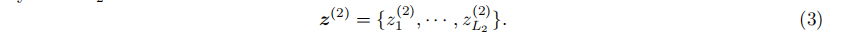   

Note that the first layer is the input layer in which we feed one sample with \\(L_{1}\\) feature to the neural network at first. Then the weight matrix from the first layer to the second layer is defined as 

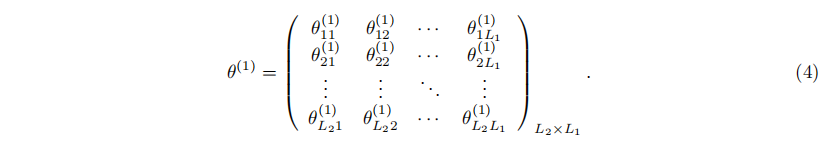   

Thus, multiplying the weight matrix Eq.4 with the neurons of the upper layer Eq.3 yields

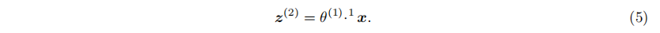   

More generally, a bias term (constant term) is incorporated as follows

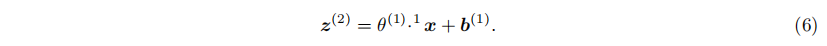 

which can also be written in the form if we absorb the constant vector \\(\boldsymbol{b}_{1}\\) into the weight matrix  

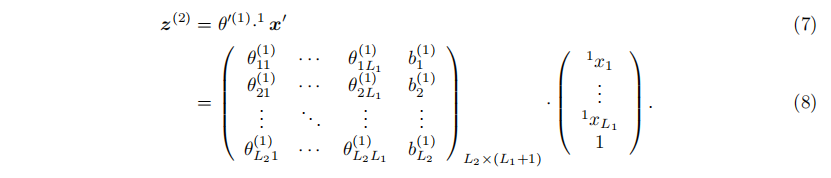 

After the transformation, an activation function is applied to \\(\boldsymbol{z}^{(2)}\\) elementwisely. For a model classification problem, the sigmoid function and the hyperbolic tangent function are widely used. Here we use the sigmoid function for instance

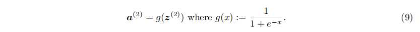 

Till now, the transformation from the first layer (the input layer) to the second layer (the first hidden layer) is done. This process can be generalized as .

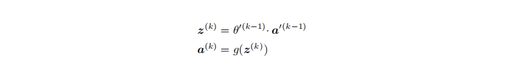 

where \\(\boldsymbol{a}'\\) is the vector \\(\boldsymbol{a}\\) absorbing 1 at the end as what I did in Eq.8. Note that \\(\boldsymbol{a}^{(1)}=^{1}\boldsymbol{x}\\).

Finally, the neural network will return \\(\boldsymbol{a}^{(k+1)}\\) with \\(L_{k+1}\\) elements from the output layer. Given the corresponding output label \\(\boldsymbol{y}^{(1)}\\), we can compute the error between the feedback \\(\boldsymbol{a}^{(k+1)}\\) and the output label \\(\boldsymbol{y}^{(1)}\\). This is normally called the loss of the result to the output. There are several candidate loss functions for model classification like the least square, the cross-entropy function. We take the least square function as the example

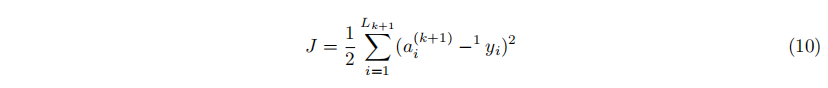 

So far, we have computed out the loss of the neural network with a bunch of randomly initialized weight matrix. No doubt, the loss would be huge. Our aim is to minimized the loss \\(J\\) by tuning the weight matrix. How? Remember your advanced calculus in the high school or the university? \\(J\\) can be envisaged as a function of every entry in the weight matrix that we want to adjust. Thus, the derivative of \\(J\\) with respect to each entries of the weight matrix would tell us how to tune the weight matrix to minimize the loss. This method is called gradient descend. And the loss can also propagate backwards to determine the gradient of the entries of the weight matrix at each layer. The full process to tune the weight matrix is also called Backward Propagation. 


# 2 Backward propagation
## From the \\(k+1\\)th layer to the \\(k\\)th layer

Let us start from the final layer (the \\(k+1\\)th layer) to the previous one (the \\(k\\)th layer). Note that the variable of our concern is the entry of the weight matrix from the \\(k\\)th layer to the \\(k+1\\)th layer, \\(\theta_{L_{k+1}\times L_{k}}^{(k)}\\). Here I only consider tuning \\(\theta\\) instead of \\(\theta'\\), meaning that the bias terms are not tuned. Updating the bias terms is similar and you can practice it afterward. The derivative of the loss function with respect to the matrix is defined as 

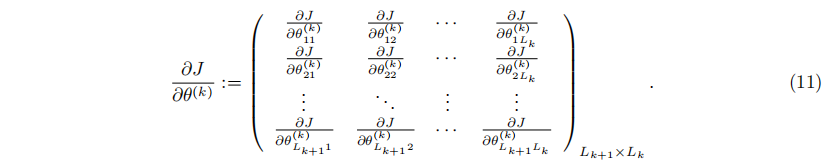 

At the mean time, from the loss function Eq.10, we obtain the derivative according to the chain rule

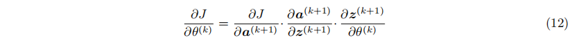 

where

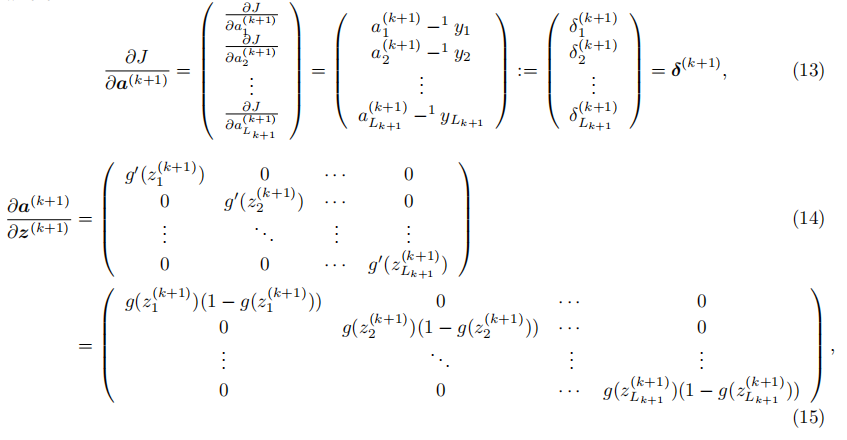 

and

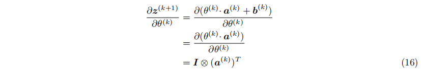 

where \\(\otimes\\) is the outer product. Simplifying the gradient Eq.12 yields

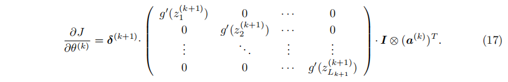 

If we define

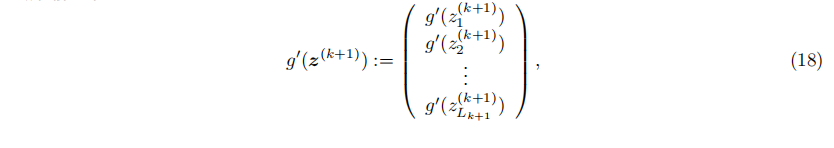 

The gradient Eq.17 can be further simplified as

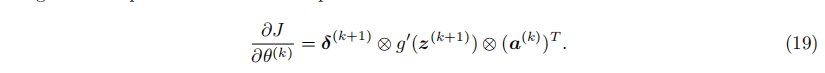 

Note that we define the outer product of two column vectors is the element-wise produce of the corresponding elements

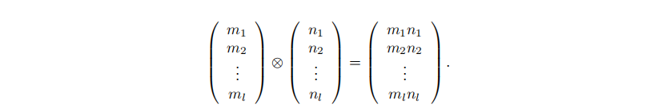 

Now, as \\(\boldsymbol{z}^{(k+1)}\\), \\(\boldsymbol{a}^{(k+1)}\\) and \\(^{1}\boldsymbol{y}\\) are known, we can update the weight matrix \\(\theta^{(k)}\\) by

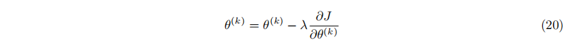 

where \\(\lambda\\) is a constant called the learning rate given in advance. 

## From the \\(k\\)th layer to the \\(k-1\\)th layer

Let's do the calculation one more time from the \\(k\\)th layer to the \\(k-1\\)th layer. At the end of this section, we will get a general formula to update all weight matrix via which we can develop the algorithm for a deep neural network. 

Now we consider one more previous weight matrix \\(\theta^{(k-1)}\\). The derivative of the loss function with respect to that matrix yields 

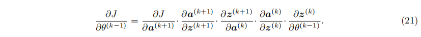 

The first two terms on the right hand side are the same as Eq.12. The third term \\(\frac{\partial\boldsymbol{z}^{(k+1)}}{\partial\boldsymbol{a}^{(k)}}\\) produces the weight matrix from the \\(k+1\\)th layer to the \\(k\\)th layer

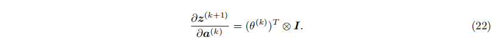 

The last two terms on the right hand side are similar to what we have done above. Finally, we get

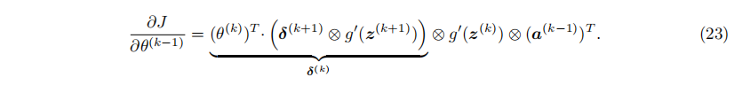 

Comparing Eq.19 and Eq.23 tells us that we can update the error

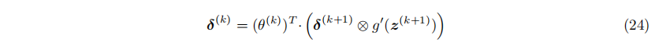 

for each transition among layers. This is how the error propagates backwards along the neural network and where the name comes from. Note that this expression is a slightly different from the formula in Chapter 9.2 of the [machine learning course](https://www.coursera.org/course/ml) by Andrew Ng of Standford. Do you see why is that? 

# 3 Training multiple samples

We have derived mathematically how to train one sample on a neural network. How about multiple samples? Easy. Because all the weight matrix of the neural network are shared for all samples, we can update the weight matrix by a fraction of error of each sample. Normally this fraction is \\(\frac{1}{\text{sample size}}\\) where in our example the sample size is \\(n\\)

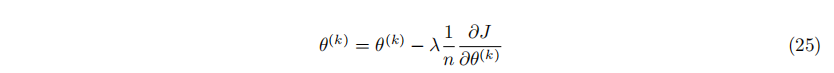 

Then, the weight matrix is tuned to minimize the error of samples. 

# 4 Program a neural network 

Till now, we have derived a general formula Eq.23 to allow us to update all weight matrix. After updating, the loss function is applied again to examine if the error is sufficiently small. If not, update the weight matrix again till meeting our criterion. Understanding the math behind is a huge step towards the expert level but not the final one. Whether you can equip it via code is essential. Here I attached my code in Python from my perspective as a reference. The user can add any number of hidden layers and deploy any number of neurons there. It is a bit like a minimalistic version of tensorflow. 

```Python
import numpy as np
import pandas as pd

class neuralnetwork:
    # initialize parameters
    def __init__(self,num_sample,num_hidden_layer_units,num_input_feature,num_output_feature,bias,learningrate):
        self.learningrate=learningrate # learning rate
        self.num_sample = num_sample  # number of the samples
        self.num_hidden_layer_units = num_hidden_layer_units # a list indicating the number of hidden layers and how many neurons for each layer
        self.num_hidden_layer = len(num_hidden_layer_units) # the number of the hidden layers
        self.weight_layer = []  # initialize the weight matrix
        self.bias = bias   # bias for the input layer and for the hidden layers
        assert len(self.bias) == self.num_hidden_layer+1, "The length of the biases should equal the length of the hidden layers plus 1!!!"
        self.units = [num_input_feature] + num_hidden_layer_units + [num_output_feature]
        # randomly initialize the weight matrix
        for num_layer in range(0,len(self.units)-1):
            temp_bias = np.zeros((1,self.units[num_layer+1]))
            temp_bias.fill(self.bias[num_layer])
            self.weight_layer.append(np.concatenate((np.random.randn(self.units[num_layer+1],
                                                self.units[num_layer]),temp_bias.T),axis = 1))

    # the activation function: sigmoid
    # could be replaced by whatever you want
    def sigmoid(self,x):
        y = 1/(1+np.exp(-x))
        return y

    # train function requires the training data, accuracy and iteration limit
    def train(self, input, output,accuracy, iteration_limit):
        go_on = True
        i = 0 # iteration indicator
        error = []  # error list recoding errors for all iterations
        iteration = []
        while go_on:
            iteration.append(i)
            error_acc = 0   # initialize error for every iteration
            stderror = []   # standard error
            sample_Z = []   # Z value of neurons for every sample
            sample_a = []   # sigmoid value of Z for every sample
            # loop all samples
            for sample_iter in range(self.num_sample):
                Zlayer = []
                a = []
                a.append(input[sample_iter])    # place the input as the first a value
                # forward computing Z and a values for all layers
                for forward_layer in range(len(self.units)-1):
                    Zlayer.append(np.matmul(self.weight_layer[forward_layer], np.concatenate((a[forward_layer],[1]))))
                    a.append(self.sigmoid(Zlayer[forward_layer]))
                # standard error by computing the distance between output layer and true output
                stderror.append(a[len(a)-1]-output[sample_iter])
                # loss function defined as the sum of the least square
                # can be replaced by other functions like cross-entropy
                error_acc += (1/2*np.sum((stderror[sample_iter])**2))
                sample_a.append(a)  # store a values for updating
                sample_Z.append(Zlayer) # store Z values for updating
            error.append(error_acc) # store error for this iteration

            # backward propagate errors to update the weight matrix
            i += 1
            if error[i-1] <accuracy or i >iteration_limit:
                go_on = False
            else:
                for sample_iter in range(self.num_sample):
                    delta = stderror[sample_iter]  # delta: standard error defined as the derivative of the loss function
                    # initialize g'(z): the derivative of the activation function at the output layer
                    deriv_sigmoid =  sample_a[sample_iter][len(sample_a[sample_iter])-1] *\
                                 (1 - sample_a[sample_iter][len(sample_a[sample_iter])-1])
                    # backward propagation
                    for backward_layer in list(reversed(range(len(self.units)-1))):
                        temp_weight = self.weight_layer[backward_layer] # store the temporary kth matrix
                        # update the kth matrix
                        self.weight_layer[backward_layer][:,:-1] += - self.learningrate/self.num_sample *\
                            np.outer(delta * deriv_sigmoid, sample_a[sample_iter][backward_layer])
                        # update delta and derivative of the activation function
                        delta = np.dot(temp_weight[:,:-1].T,delta * deriv_sigmoid)
                        deriv_sigmoid = sample_a[sample_iter][backward_layer] *\
                                 (1 - sample_a[sample_iter][backward_layer])
        self.learningspeed = {'error': error, 'iteration': iteration}
        self.lsdf = pd.DataFrame(self.learningspeed)
        return sample_a, self.weight_layer

    # predict
    def predict(self,input,weight):
        out = input+[1]
        for i in range(len(weight)):
            out = np.dot(weight[i],np.array(out))
            out = self.sigmoid(out)
            out = np.concatenate((out,[1]))
        return out[:-1]


# test
inputx = np.array(([0.2, 0.5, 0.5,0.3], [0.1, 0.2, 0.15,0.1],[0.7,0.9,0.4,0.8]))
outputy = np.array(([0.5, 0.4], [0.9, 0.1],[0.3,0.5]))

# build the neural network
nn=neuralnetwork(num_sample=inputx.shape[0],num_hidden_layer_units=[15,14,15,16],num_input_feature=inputx.shape[1],
             num_output_feature=outputy.shape[1], bias=[0.1,0.2,0.3,0.4,0.4],learningrate=0.2)

# set the accuracy and the iteration limit
acc = 1e-7
iter = 20000
# train the neural network
out_a,weight = nn.train(inputx,outputy,accuracy = acc,iteration_limit=iter)
# plot the learning process
nn.lsdf.plot(x='iteration',y='error')

# predict
input = [0.19, 0.51, 0.49,0.29]
out = nn.predict(input,weight)

```

You can also clone it [on my Github](https://github.com/xl0418/Tensorflow/blob/master/NeuralNetwork.py) 

# The end

My code is obviously not the most efficient one as a lot of loops are used. But in another sense it is easy to read for a starter. As you see in the derivation and in the code, there are a huge amount of independent computing that can be parallelized to speed up. So the future plan is to parallelize the code on GPU which may substantially improve the efficiency of the neural network. It would also be a good practice for you to step into the machine learning field. 

# Reference

- An introduction to the math used in Machine Learning:  [The Matrix Calculus You Need For Deep Learning
](https://explained.ai/matrix-calculus/index.html).

- A concrete derivation of backward propagation for a two-layer neural network in Chinese [here](http://www.cnblogs.com/charlotte77/p/5629865.html#!comments).