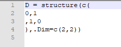
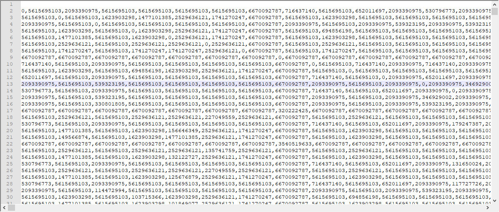

Recently, I was focusing on my 3rd PhD project with mathematical modeling. It was about the extension to the [neutral theory](https://www.nature.com/scitable/knowledge/library/neutral-theory-of-species-diversity-13259703). I am not gonna reveal it now but will bring back in the future.  So I was away from the blog for a while and have to put machine learning series aside, although the derivation of the recurrent neural network is done. It is coming soon as well. Finally, the mathematical model has been done. I have some time to talk something that I've been doing except the modeling when waiting for the simulation results. In this post, I am gonna record a silly issue about loading data in R after extracting the a subset of a big data by Bash.  

<!--more-->

# The right matrix format to load in R

If you have tracked my posts, you may remember that I used a bash script to extract a matrix out of a big and complex structured m file (see [here](https://xl0418.github.io/2018/10/29/2018-10-29-sed/)). But I mistakenly modified the matrix to fit the matrix format in R.

 

What's wrong with this format? It is a function to call instead of a data to load. Thus if the data in the `structure()` is very big, like 10000x10000, it is very time-consuming to run the function in R. But our aim is to read the matrix of this size or even larger. It is not supposed to be problematic for R. 

After a while of brainstorm, I kind of thought it might be due to the matrix format and the way I load the data in R. The command `source()` actually calls the function written in the sourced file.  Thus, to create a matrix by using `structure()` it is easy to exceed the memory size. 

The solution is that we could use `read.csv()` to load the data into R, which is much faster and more efficient for large data sets. To achieve that, we need rewrite the raw data in a csv format. The following is how it looks like in the notepad 

 

Notice that the first line is left blank. It is supposed to put the headers for columns. Then we can directly read it in R by using 

```R
x = read.csv(data,header = FALSE)
```

Super fast and it's done. 

Finally, to extract the matrix from the raw data, you can just follow what I did before ([here](https://xl0418.github.io/2018/10/29/2018-10-29-sed/))). And replace the 6-15th lines with 

```Bash
A=$(grep -c 'D'{'length(D)+1'}' = \[' HDs"$j$i".Rdata)
B=$[$A-1]
sed '/D'{'length(D)+1'}'/{G;s/\nX\{'$B'\}//;tend;x;s/^/X/;x;P;d};p;d;:end;s/D'{'length(D)+1'}'/D/;:a;n;ba' HDs"$j$i".Rdata>HDt"$j$i".Rdata
sed -n '/D = \[/,/\];/p' HDt"$j$i".Rdata>HD"$j$i".csv
sed -i -e 's/D = \[//' -e 's/\];//' -e 's/ /,/g' -e 's/,;//g' HD"$j$i".csv
```

where I just replace the space by the comma and delete the first and last line of the raw matrix. The `;` at the end of each line is also removed.

Enjoy!

