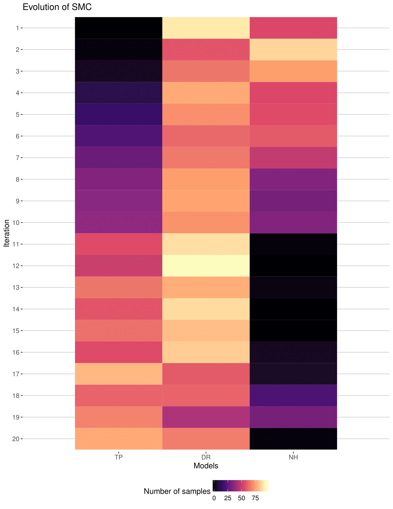

In the last few months of my PhD project, it is unimaginable that how busy it could be. You need to focus on the current work to finish them, analyzing data, writing paper, structuring the final thesis etc. whilst think about the future, going to industry or staying in academia. To me, I enjoy the process of researching, learning new techs, tackling with challenges. This is the essential need that I want. The outer environment is to support decorating the need to make the environment attractive. So it feels like clothes to human, no matter what kind of clothes they are their essential function is to cover the body that human wants, keeping warm and comfortable. But undoubtedly if available human is chasing after the most fancy clothes that meet human's additional requirements besides the basic need. Think through this, when I know clearly what I want, what kind of job I want to do is clear, meeting my basic need and seeking the most luxury that I fit. 

The words above are more like a conclusion that I came up with in the last few months and an excuse/explanation of no posting. Here, I would like to record some evolutionary algorithms that I used in the projects I have done and the animations of them. I still have no time to go into the details and cannot post at a normal frequency for a while (at least before my graduation). But I promise I will concretize them in the future.     

<!--more-->

# The standard Approximate Bayesian Computation

With the development of computer science, people start to be able to solve more problems that are high computationally demanding. In 2013, Toni *et al*. overviewed the standard ABC algorithm and developed a sequential Monte Carlo variant to accelerate the convergence of parameters. This series of ABC-like methods is usually called "likelihood-free" method, or more precisely "analytic likelihood-free method". The basic idea is that it exploits the computational power of computer to generate large amount of data under the focal model and pick up the parameters that produce the data that is most analogous to the reality. Thus, people claim that the obtained parameters are the most likely parameters to reassemble the truth. 

In my project of studying trait-population model, I modified this method a bit and successfully recovered the model parameters from simulation experiments. Later on, I applied our model to baleen whales and found the baleen whales are undergoing a weak environmental adaptation and a relatively strong competition (paper submitted soon).

Here, I would like to show you an animation of how ABC algorithm works.  

<video width="100%" height="800" src="MCMC3chains_test3.mp4" controls="controls">
The `<video>` tag is not supported by your browser.
</video>

In the video, three Monte Carlo chains are deployed. They are independent of each other, exploring the parameter space from different initial conditions. Normally, it is hard to judge when the chain converges. So, you need to run a long time to check. One alternative way is to calculate the autocorrelation of the chain. You can google that if you want to know more details. 

# ABC-SMC for parameter estimation and model selection

Approximate Bayesian Computation-Sequential Monte Carlo algorithm is an parallelized extension to the standard ABC algorithm. The basic idea is to do many sample simulations at one generation. Then, the best fit parameters are chosen to gain higher weight to be sampled in the next generation. With the generation proceeds, the best fit parameters converge to the "true values". To do model selection, the models are simply treated as one parameter but at a sequential level advanced to the other parameters. That means you need to chose models first and then sample parameters to complete the sampling process.

The following figure shows how the samples converges to the true value for parameter estimation. It started with a uniform prior information of &alpha;.
 

The following figure shows how model selection works under ABC-SMC algorithm. The details are coming in the future.
 

