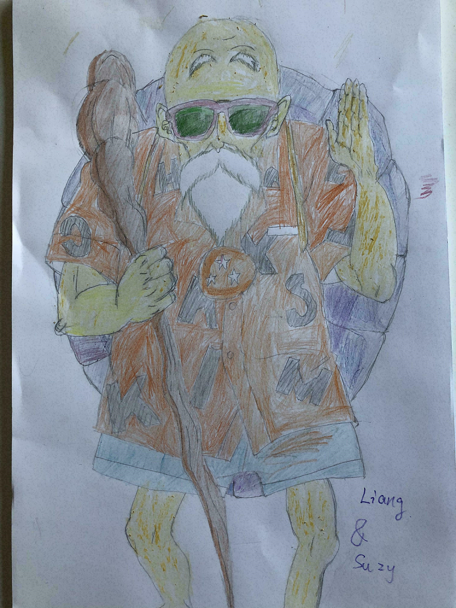

Do you like comics? I am a comics fan, majorly favoring Japanese comics and some Chinese comics with the rise of Chinese comics industry in recent years. Why do I mention this? I mean to say drawings are usually the most straight way to express abstract ideas. This is why I want to show an animation of our model to explain such complex mechanism instead of using tons of papers filled with equations.   

<!--more-->

# An animation of trait-population coevolution for a single attraction

We have constructed a mathematical model to describe how traits of species interplay with their abundance under environmental adaptation and competition along a phylogenetic tree. For simplicity, we assume one attraction in the community that pull traits evolve toward one single optimum trait that better utilize natural resource. In this model, population dynamics weight the species' competitive power, i.e. the species with large population size gains more competitive power. We would like to see what kind of trait pattern under such mechanism. The animation below shows how it works along a given phylogenetic tree.  
 
<video width="100%" height="800" src="singlespecies5.mp4" controls="controls">
The `<video>` tag is not supported by your browser.
</video>

The video is consisting of two models showing different magnitude of attraction towards the optimum for 5 species. The area of red dots denote the population size of that species.\\(x\\) axis denotes the evolutionary time while \\(y\\) denotes the trait values. The optimum trait is assumed as 0 without loss of generality. The highlighted by green lineage is the destined species giving birth and going extinct. More details are coming after the paper submission.  

# An animation of trait-population coevolution for multiple attractions

In the following video, 15 species are evolving under 5 attractions. You can see how they compete with each other and explore the new niches. 

<video width="100%" height="800" src="multi6species15.mp4" controls="controls">
The `<video>` tag is not supported by your browser.
</video>

Have fun!

