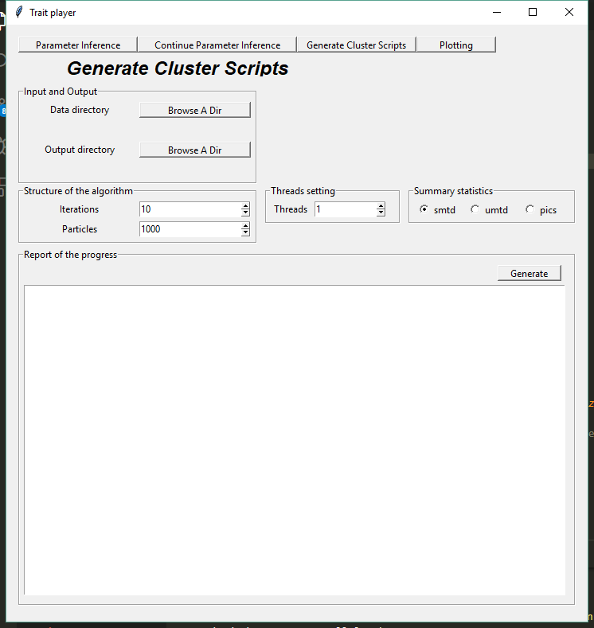

Thesis submitted! Finally, I could have a bit of time to update this blog before getting feedback from reviewers of two submitted papers. So, I will dig several pits as what I did before and see if in the future I could fill them : - ) The first pit stems from my thinking of that how we, biological theoritians, are able to sell  our work to empiricists. Our work and interest are to stablish complex mathematical models to mimic biological processes to reveal the underlying mechanisms, which form the observed phenomenon. We could code the processes, do statistic analysis to select the most prominent mechanism, infer the likely generating parameters. However, empiricists may have problems even setting up an environment for a programming language in which we used to deploy our models as their focuses are on field or lab experiments which I have not a clue of what they are (exaggerated).  Therefore, to bridge the worlds of empiricists and theoritians, a concrete tool is imperative. GUI (Graphical User Interface) of an abstract model is the right way. (This is the way!  -- Mandalorian).  In this blog, I introduce one GUI example of my model and show how it works within a few clicks. 

<!--more-->

# A brief introduction of the trait evolution model

Diversity in traits of species has long been intriguing to biologists. One of the most famous examples is the Galápagos finches, which is also known as Darwin finches. Darwin's Finches comprise a group of about 15 species. Their beak sizes are evidenced to associate with the size of seeds that are available in environment, showing apparent evolutionary evidence responding to ecological changes. In the species *Geospiza fortis*, people found that the beak size of the birds is larger when large seeds are more available. Conversely, when small seeds become more available for some years, small beaks are pervasive in the population.

In our model of trait evolution with population dynamics, we incorporate the phylogenetic information into consideration. Furthermore, abundance of species plays a role in species interaction, hence,  tunes the trait evolution pace. An animation has been posted before [here](https://xl0418.github.io/2019/06/21/2019-06-21-TPmodel/), which illustrates how the traits of species evolve along a given phylogeny. The manuscript is under review. Details can be found there once it gets published.  

With this model, empiricists can input the phylogenies and simulate the traits of interest. Using approximate Bayesian computation methods and comparing the simulated traits with the observed traits, one can infer the strength of the environment stabilizing selection and competition. The purpose of designing a GUI is to free empiricists hands from implementing the code. Instead, only a few clicks can do all the work.

# GUI 

I use `tkinter` to develop the GUI. It has an exhaustive [document](https://docs.python.org/3/library/tkinter.html) to help you get familiar with it. So, I am not ganna show you how to code it. You can find the code [here](https://github.com/xl0418/Trait_pop_model_sim/tree/UI-branch). But I would like to show you why empiricists would love it!

The whole model and nearly all its functions are wrapped into this interface.  

In the page of Parameter Inference, users can specify their own phylogenies with observed traits data and also assign a folder to store the output. The structure of the algorithm (ABC) can be set by giving the number of iterations and particles for each iteration. The larger the values are, the accurate the inference is. But it also takes longer time for computation. Parallel computation has been implemented with threads being indicating how many threads you want to exploit. We have three summary statistics to compare the similarity between the simulated traits and the empirical traits. Details can be found in the paper. 

As usually we don't know how many iterations are sufficient to get a good enough result, we may start with a small number of iterations to check if the results converge. If not, we can continue with this Continue Parameter Inference page.   

In this page, one additional setting appears. You can specify the previous result on which you want to continue. Then, set a continue number of the iterations while the number of the particles inherits from the previous result. This page offers a choice of cutting jobs into pieces and running them at different time. 

Although ABC approach is a nice likelihood-free method for parameter inference, high computational demanding limits its applicability. Normally, I need to work with a cluster to free my desktop for other works. So in the page of Generate Cluster Scripts, one can set all parameters aforementioned and click one button to generate a script to submit jobs on the cluster. This is one example of the peregrine cluster of the University of Groningen. You can modify it accordingly.   

Furthermore, one can even do data analysis on the results by using GUI. Here, I set a plotting function to investigate the distributions of the estimated parameters. 

  

More functions can be developed. With GUI, empiricists would love to try theoritian's models. One may argue that it is convenient but the model is hidden behind the interface so that it lost the model's plasticity. Well, when you succeed to attract empiricists' attention, GUI's job is done. Further model adjustification relies on collaboration. You have already sold your work!  

 