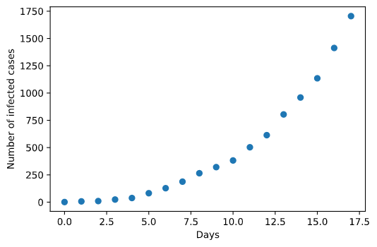

Approximate Bayesian computation (ABC) is a kind of likelihood-free method that utilizes computational power to generate a huge amount of simulations with randomly chosen parameters to hit the target - the observations. The generating parameters that produce the results that are most analogous to the observations are recognized as the best inference of the truth. This is analogous to the idea of neural networks of machine learning. The difference is that ABC requests process-based modeling, which bases on knowledge of the underlying mechanism behind the data. In contrast, neural networks neglect such process-based modeling but only needs to construct a neural net structure to train for fitting data. Thus, the advantage of neural networks is that it provides a general inference approach without need of knowing the mechanisms. Nevertheless, the disadvantage is also on it. The interpretation of the processes behind the data is lacking.  This is why it is widely used in pattern recognition but in biological processes interpretation. Both methods have limited structure types although the combination of them can be infinite. Therefore, coding a general framework to fit any type of models is feasible. While Tensorflow of Google and Pytoch of Facebook stand out in machine learning as the examples of such general frameworks, not many groups are focusing on ABC development. Only a recent [package](https://arxiv.org/pdf/1711.04694.pdf) by Dutta et al. in Python is released setting a good example. Here I would like to share a simple version with an application to the recent coronavirus outbreak in the Netherlands. Just for fun and keeping my coding skills warm in the period of quarantine regulation. 

<!--more-->

# A brief introduction of the ABC

Approximate Bayesian computation constitutes a family of computational methods with different algorithms that base on Bayesian statistics. An overview of this approach can be found [here](https://journals.plos.org/ploscompbiol/article?id=10.1371/journal.pcbi.1002803). The following figure from Sunnaker et al. summarizes the idea accurately. 

Normally, one iteration that constitutes the above mentioned steps is not enough to get a convergent estimation. Hence, taking the posterior distribution of the estimates as the prior distribution in the next iteration to presume the algorithm learning is usually used. This is why ABC like approaches are computational demanding. However, parallel computation can ameliorate it a bit. 

In my toy package, users can prescribe the number of the iterations and the simulations in each iteration. After initializing the model and parameters for the first iteration, parameter inference can be done automatically. The code is [here](https://github.com/xl0418/ABCer). Welcome for comments.

# The coronavirus outbreak in the Netherlands 

Since 27th February 2020 the first infected was reported in NL, the coronavirus pandemic has caused over 1700 infections so far.  



As an illustration of how this general ABC approach works, I would like to estimate parameters of 2 models and make inference on the future growth of the infected cases. Note that this is only a toy example. Models are very simple and may have analytic solutions. But my purpose here is to show how this ABC package (ABCer) works for different models in a likelihood-free way. 

# The usage of the package ABCer 

As aforementioned, with this package you only need to provide the observation data and specify your model, the parameters to be estimated, the structure of the algorithm, i.e. the number of the iterations and the simulations per iteration, and the prior distribution of the parameters. 

For example, from the observation of the coronavirus outbreak and previous experience of pandemic, an exponential growth model is expected to describe the virus infection. 

```Python
from ABCer import ABCer
import numpy as np

# Model 1
def model1(para, time_survey=np.arange(18)):
    y = para[0] * np.exp(para[1] * time_survey)
    return y
```

So far, I obtained the infection data for 18 days. Hence, I am ganna use these data to compute the similarity between simulations and the observations in ABC algorithm. 

Now, we can specify the structure of the ABC, provide the observed data and initialize the model and the parameters in the algorithm. For example, here we chose 50 iterations and 10000 simulations for each iteration.  

```Python
# The data of the coronavirus outbreak in NL from 27-2-2020 to 17-03-2020
observations = np.array([
    1.0, 7.0, 10.0, 24.0, 38.0, 82.0, 128.0, 188.0, 265.0, 321.0, 382.0, 503.0,
    614.0, 804.0, 959.0, 1135.0, 1413.0, 1705.0
])
time = np.arange(len(observations))

# Initialize the ABC approach
test_ABC1 = ABCer(iterations=50, particles=10000, observations=observations)
test_ABC1.initialize_model(model1)
test_ABC1.initialize_parameters([0.0, 1.0])

# Launch...
test_list1 = test_ABC1.ABC(prior_paras=[0.0, 1.0, 1.0, 2.0])
```

The mean of the estimates for each iteration will be printed out. In this example, the values tend to stabilize with the proceeding of the algorithm, indicating convergence achieved. 


Now, we can use the inferred parameters to make prediction of the infection.

```python
import matplotlib.pyplot as plt
# The true data
plt.plot(time, observations, 'o')

# Collect the inferred parameters
para_inferred = []
para_inferred.append(np.mean(test_list1[0][20, :]))
para_inferred.append(np.mean(test_list1[1][20, :]))

# Predict the infection till 21 days
extend_time = np.arange(21)
y_inferred = model1(para_inferred, np.arange(21))

# Plot the prediction
plt.plot(extend_time, y_inferred, 'x', color='r')
plt.xlabel("Days")
plt.ylabel('Number of infected cases')
```

The red cross denotes the estimate infection. Well, it seems that this model has a lower increase than the observation at the beginning stage but a higher increase than expected later on. This is probably due to the government didn't take any measures at the beginning so that the increase is big. But when it realized how serious the situation is the government started to take action so that the spread of the virus is limited. 


# Another candidate model

Now, we can test any models and estimate their parameters in the same way. Here I tried an additional simple model - a polynomial model - to see if we get a nicer regression.

 

The prediction fits the observed data better at the beginning phase. But in the latter phase the infection is underestimated. This means a polynomial model with up to second order cannot fit the data very well. 


# Conclusion

Ok, as I said the purpose of this post is to show you how the general ABC approach works with different models in a user-friendly manner. To investigate the best fitting model, a model should consider how the society and the government act accordingly like the quarantine, self-protection behavior, etc. This ABCer package is just a simplest example. More complex structure of the algorithm, distinct summary statistics, the perturbation kernel across iterations can be implemented in the package. Feel free to explore!  

 