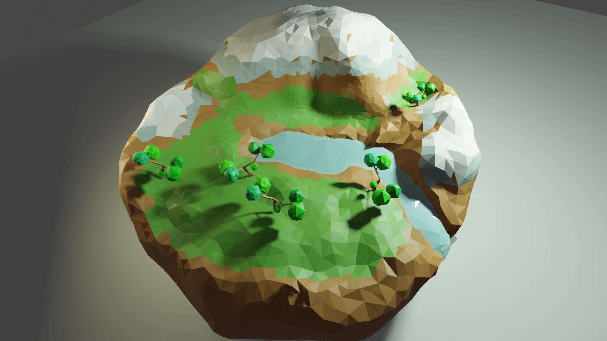
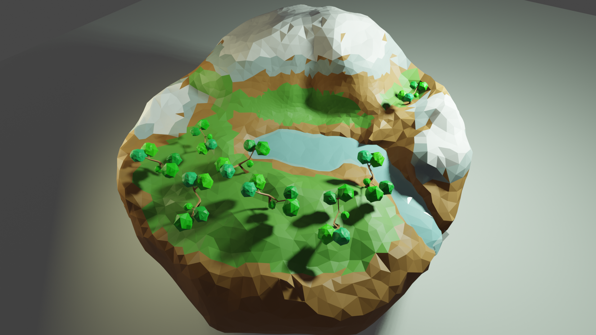

Moving from the Netherlands to the UK on 11th Jan 2021, just at the right time when brexit actually starts, when COVID-19 variant virues stopped down the UK, when everything is mess. However, we suceeded. Two grown-ups, one child and one cat. Anyway, I settled down now and started work in Oxford. Today, I'd like to share building a simple scene using [Blender](https://www.blender.org/) to present theoretical models.

<!--more-->  

## The plant community model

The model is to describe how plants compete and coexist in a community. My work is to study bias in inferring density dependence invovling all kinds of systematic errors and also mechanistic misunderstandings. The model is simple. Plants produce seeds. Seeds disperse over the community. Seeds grow to plants. Normally, it is abstract to show the model processes in academic research. I was thinking to present it in a more vivid manner. 

  ## Blender: create a small low poly scene

Thus, I learned Blender to create a small low poly scene. It is more like building an animation scene. 

Plants start with 5 apple trees. They produce apples that spread everywhere. Finally, after competition, a few grow to apple trees.

A video is here. 

<video src='smallworld.mp4' controls='controls'  width='100%' height='100%'>The `<video>` tag is not supported by your browser.
</video>
Well, it looks a bit dull but a good start, doesn't it? It is a lot fun to learn a new skill!
